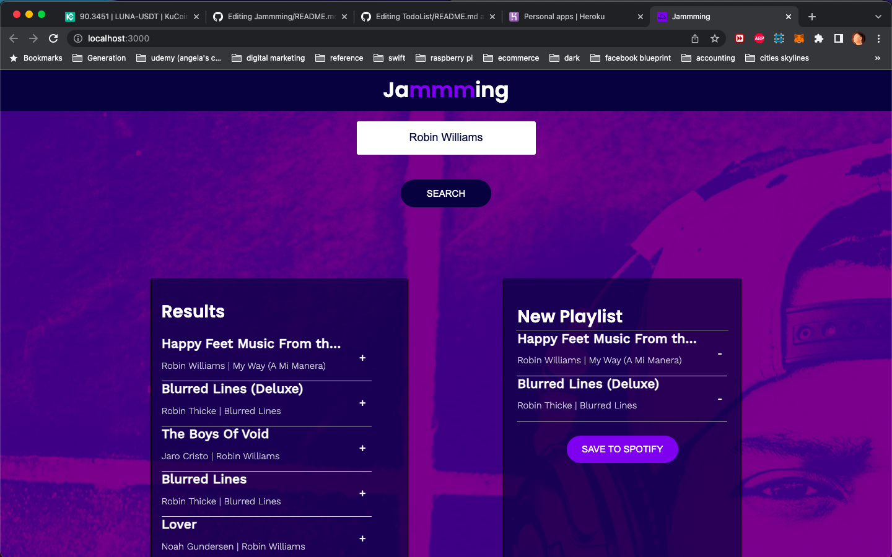

# Create a Playlist App With the Spotify API

## Challenge
Build a website that allows users to search the Spotify library, create a custom playlist, then save it to their Spotify account

## Available Scripts

In the project directory, you can run:

### `npm start`

Runs the app in the development mode.\
Open [http://localhost:3000](http://localhost:3000) to view it in your browser.

### `Link`

[https://jammingreactjsapp.herokuapp.com/](https://jammingreactjsapp.herokuapp.com/)

### Screenshot

## Author
- Website - [Gareth's Linkedin](https://www.linkedin.com/in/garethfong/)

## Acknowledgments

I love to thank Generation Singapore and my lecturer, Jean Looi for their guidance and time. 
